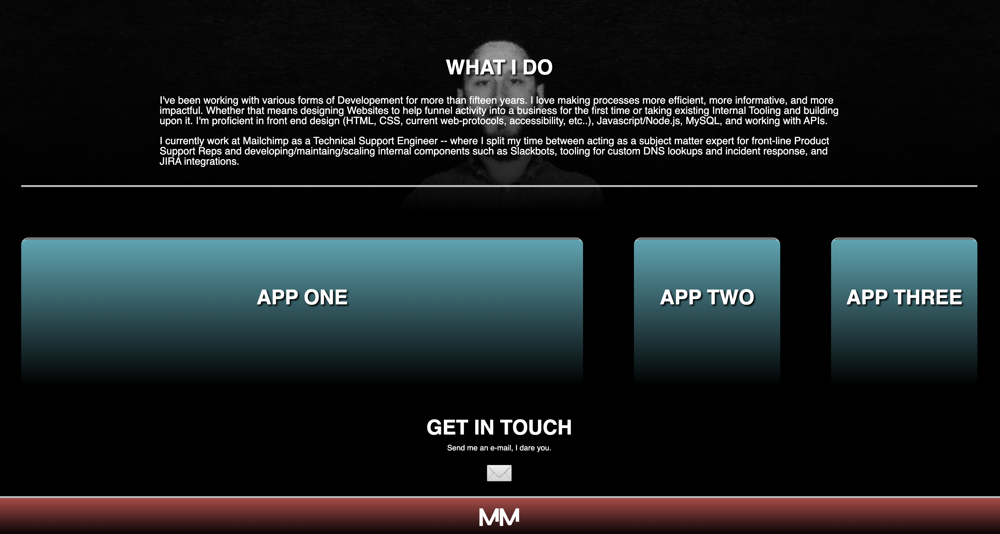

# Portfolio - Michael Martens

Here's what the code does:

Index.html houses the main structure of the site.
Style.css handles the styling (Style sheets for other color ways may be introduced in the future)

The site uses a mix of flex / media queries to handle responsiveness.

View the site here: https://makeithappenmike.github.io/portfolio/

Contributions by Michael Martens

Screenshot:

 
